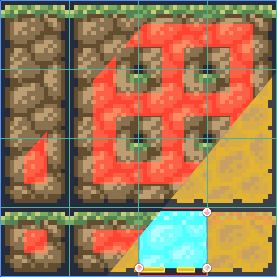
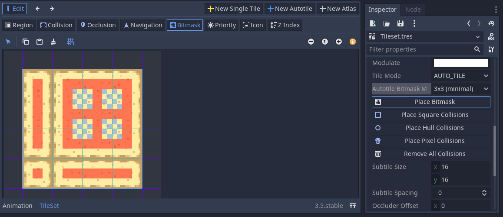
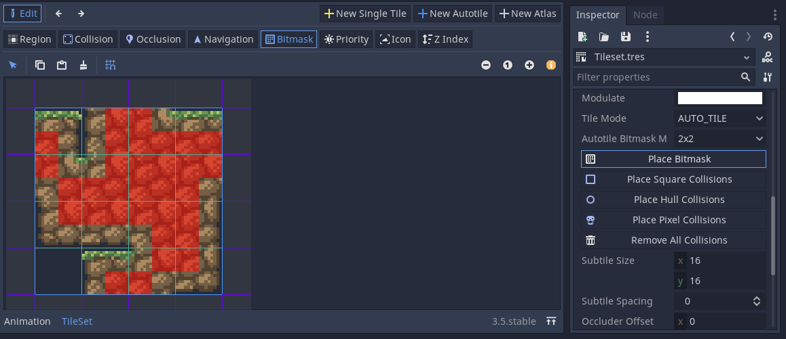
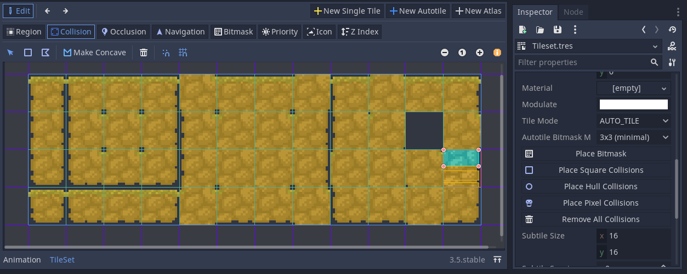

# Godot Tile Setup Helper

On the asset library! https://godotengine.org/asset-library/asset/1502

This is a Godot 3.5 addon to automatically place bitmasks and collisions into TileSets. It places buttons in the Inspector to do so.

For bitmasks, it supports 2x2 and 3x3 minimal bitmasks (including the kind with wildcard inside corners).

For collisions, it supports any tiles, including basic atlases. The generated collisions can be: square, convex hull (wrapped around the tile), or pixel perfect (optimized scanlines).

License: CC0 (public domain!)

